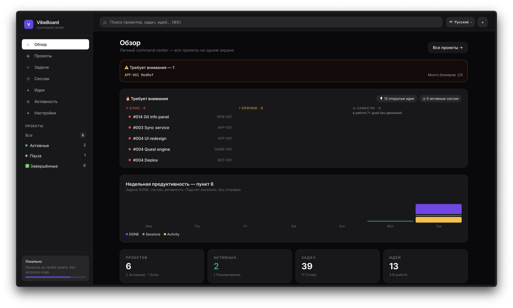
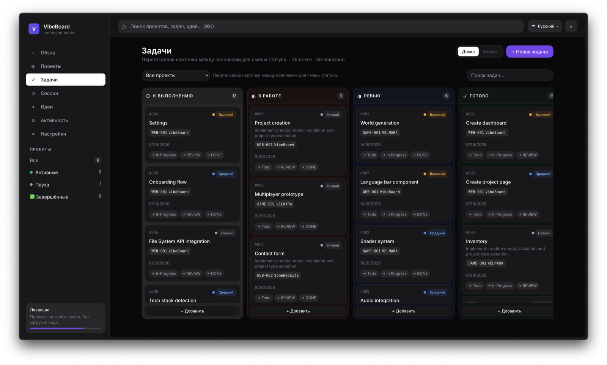
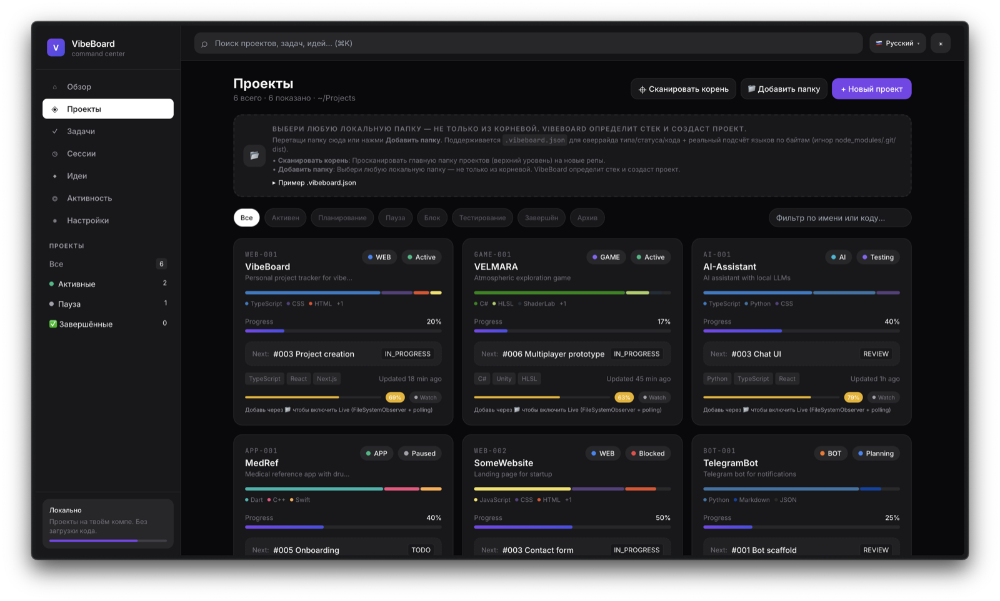
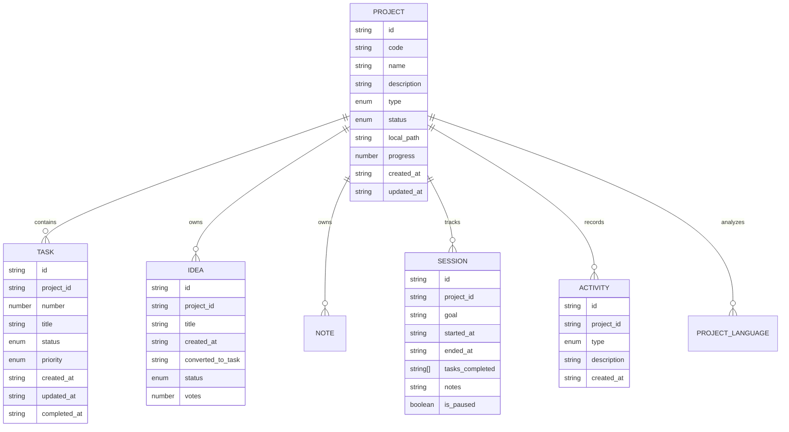
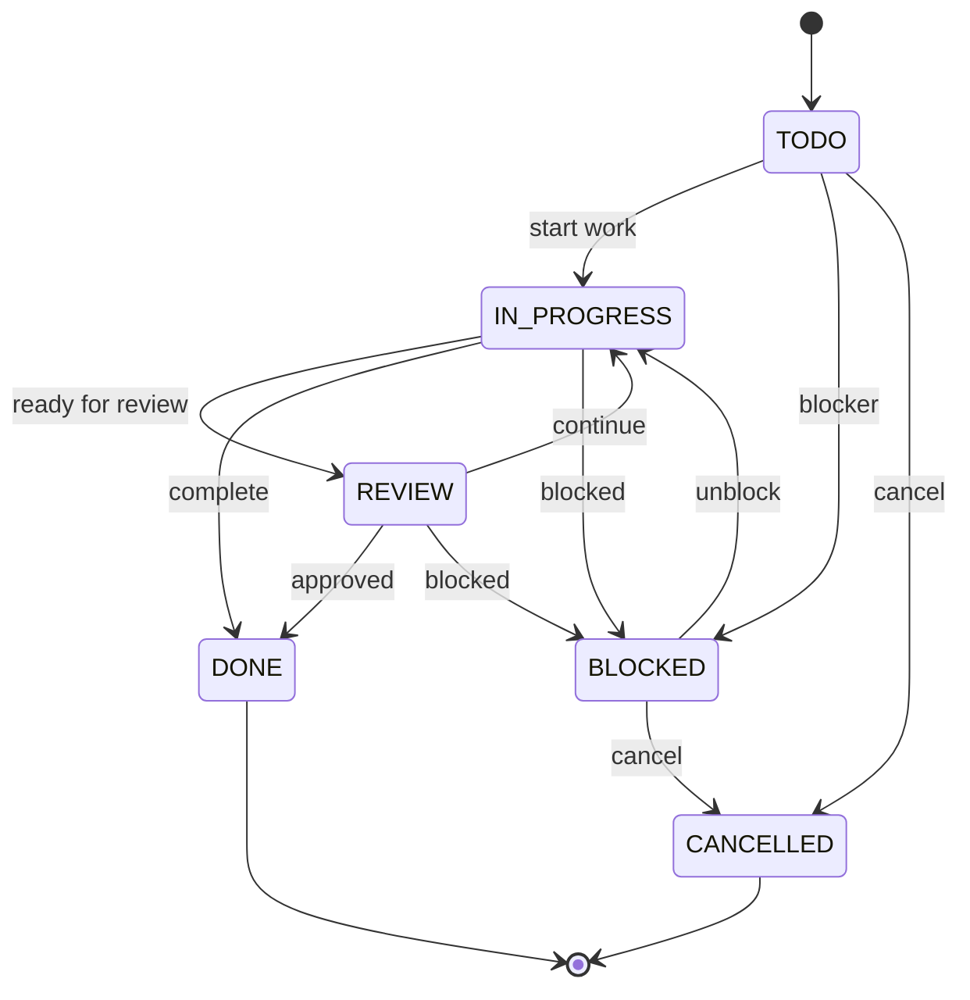
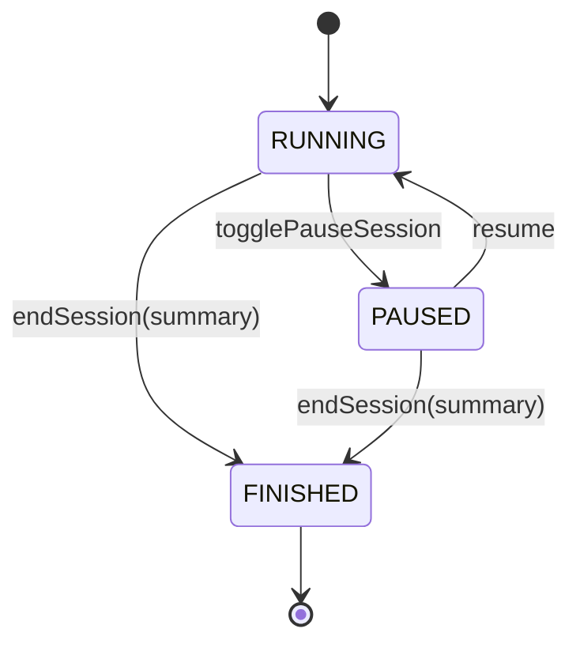

# VibeBoard — personal tracker for vibe coding

  [...]

**VibeBoard** is a personal command center for all your coding projects.
Point it at your `~/Projects` folder — it will discover repositories and show
their stack, languages, progress, tasks, ideas, notes, sessions and git activity.
Everything runs locally, no code ever leaves your machine.

> Not Jira. Lightweight, fast, local-first.

> ⚠️ **Vibe-coded project.** VibeBoard is written entirely in vibe coding format —
> the code was created iteratively together with AI agents (OpenCode / Claude Code).
> So bugs, rough edges and unfinished bits are possible: something may glitch,
> lag, or look odd. That's normal for 1.0 — found a problem, open an issue
> or send a PR, and we'll fix it together.

## Features

**Projects**
- Folder selection via File System Access API, drag&drop, manual path
- Auto-discovery via `.git / package.json / pubspec.yaml / Cargo.toml / go.mod` …
- `.vibeboard.json` support in project root (type, status, code)
- Codes `WEB-001 / APP-001 / GAME-001 / BOT-001 / AI-001 / TOOL-001 / OTHER-001`
- Statuses, local path, project group switching

**Tasks & Ideas**
- Kanban boards with drag&drop + compact list view
- Statuses, priorities, effort estimates, tags, votes for ideas
- One-click idea → task conversion, bulk convert

**Sessions**
- Live timer, pause, notes log, manual summary
- Tasks closed during a session are linked automatically
- One-click summary delivery to OpenCode / Claude Code

**Analysis**
- Languages from real byte-level file analysis (GitHub-style bar)
- Tech stack from project configs, no guessing
- Project health score: progress · blockers · freshness · git
- Real commit history from `.git/logs/HEAD`, `commit → #001` linking

**More**
- Global search `⌘K` with jump-to-card
- Dark/light theme, EN/RU interface, PWA + offline
- Project export/import as JSON, demo data on demand

## Screenshots





## Quick start

```bash
git clone https://github.com/ask444d/vibeboard
cd vibeboard
npm install
npm run dev      # http://localhost:5173
npm run build    # production
npm run preview
npm test         # 27 tests
```

Requires Node 20+ (22 recommended). File System Access API is Chromium-only
(Chrome/Edge/Arc/Brave); other browsers fall back to manual adding.

## Privacy

Local-first: disk is read only after you explicitly pick a folder,
metadata lives in `localStorage`, code never goes outside.

Agent integrations talk to `localhost` only.

## Agent integration

- **OpenCode**: `opencode serve --port 4096 --cors http://localhost:5173`,
  put `http://localhost:4096` into Settings → Integrations → OpenCode hook —
  the summary will create a session (`POST /session`) and land as its first
  message (`POST /session/:id/message`). No server password (basic auth
  is not supported).
- **Claude Code**: `node scripts/vibeboard-agent-relay.mjs --port 4100`,
  put `http://127.0.0.1:4100/hook` into the Claude Code hook field,
  plus the SessionStart hook from the script's `--help`.
- Custom format? Any URL of yours — it receives a raw POST of
  `{sessionId, goal, summary, tasksCompleted}`.

## Structure

```
src/lib/       — types, utils, i18n, health, git, agents, watch, plugins
src/store/     — Zustand + persist (localStorage, migrations)
src/components/— TaskBoard, IdeaBoard, ProjectCard, GitPanel, …
src/pages/     — Overview, Projects, ProjectPage, Tasks, Ideas, …
scripts/       — relay for Claude Code
src-tauri/     — desktop build foundation
```

Details — `docs/ARCHITECTURE.md`, plans — `ROADMAP.md`.

## Диаграммы данных и состояний

Ниже — компактная версия диаграмм, которые описывают модель данных и основные состояния задач/сессий. Полная версия и дополнения — в `docs/DIAGRAMS.md`.

ER-диаграмма (основные сущности):



State diagram для задач (Task lifecycle):



State diagram для сессий (Session lifecycle):



Ключевые бизнес-правила (коротко):

- Данные хранятся в одном Zustand store: `projects[]`, `tasks[]`, `ideas[]`, `notes[]`, `sessions[]`, `activities[]` и некоторых UI-параметрах.
- `Task.number` генерируется в рамках проекта (`max + 1`).
- Когда задача помечается `DONE`, если есть активная сессия, задача добавляется в `session.tasks_completed`.
- `Idea` можно конвертировать в `Task` (один к одному) — реализовано в `convertIdeaToTask` и `bulkConvertIdeas`.
- Миграции состояния управляются через `persist` с `version` и функцией `migrate` в `src/store/useStore.ts`.

Полная, подробная версия диаграмм и пояснений: `docs/DIAGRAMS.md`.

## Contributing

Bugs and ideas go to issues, fixes go to PRs (see `CONTRIBUTING.md`).
Good first tasks are labeled `good first issue`.

## License

MIT — do whatever you want, vibe coding for good.
