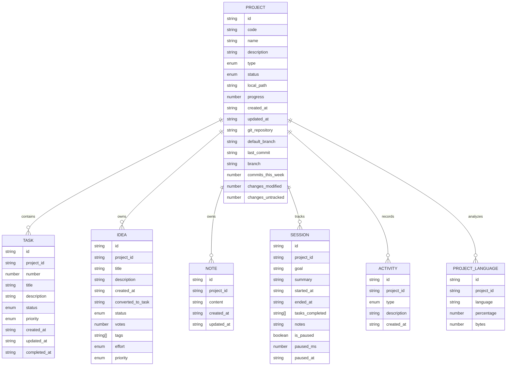
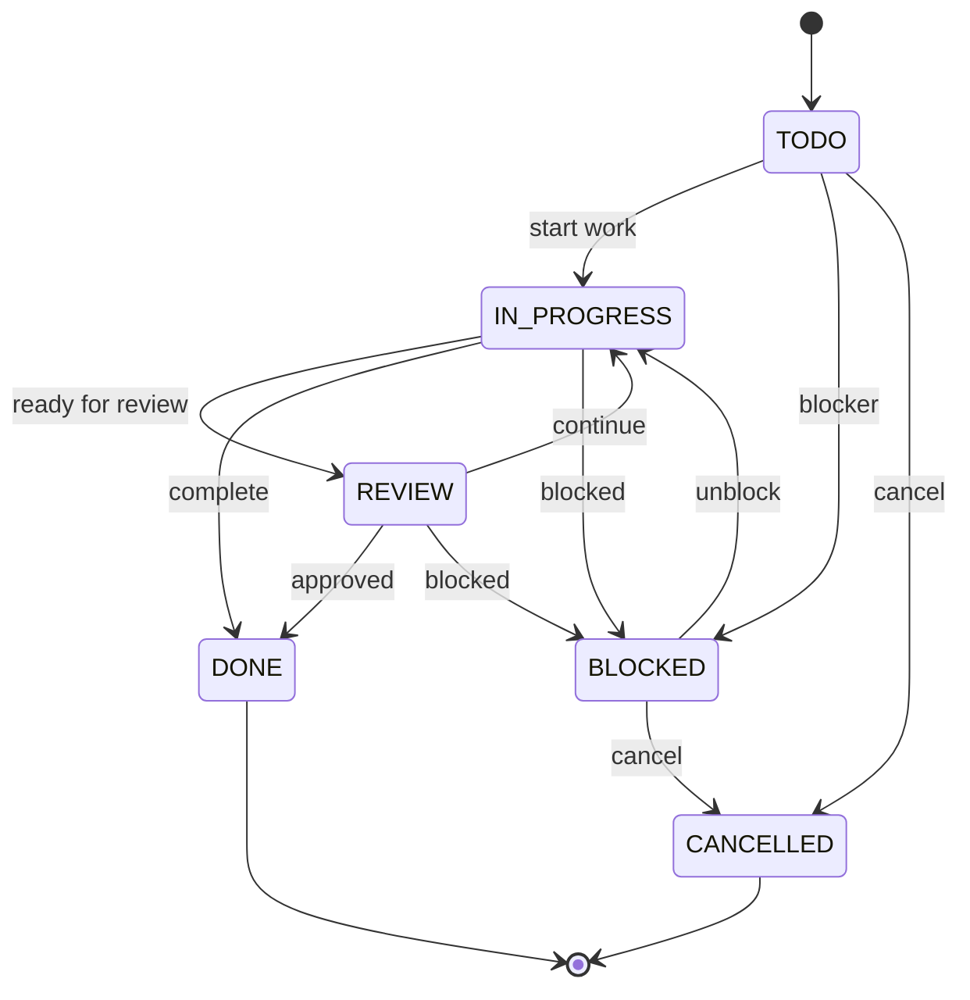
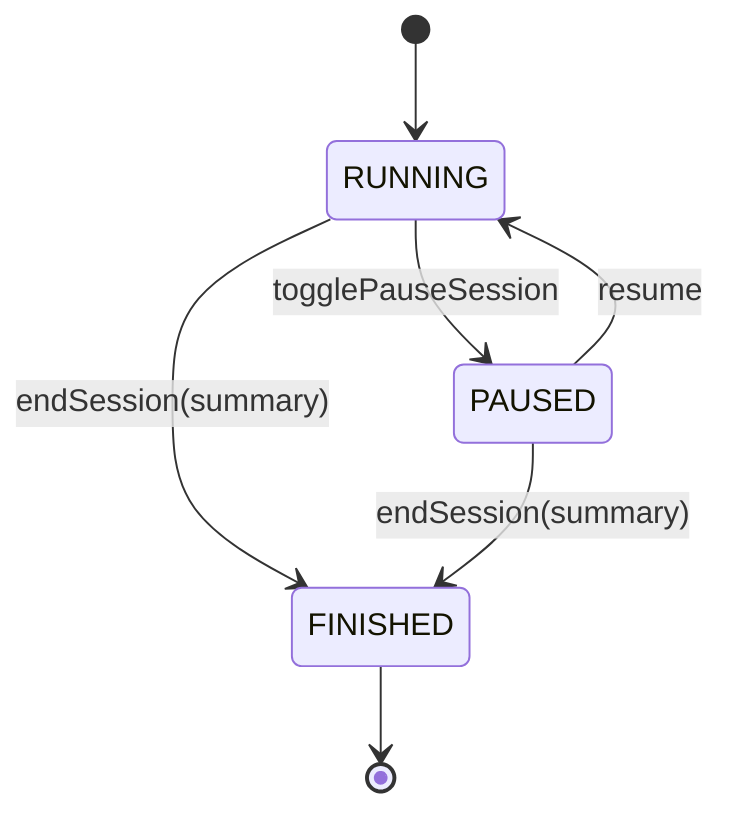
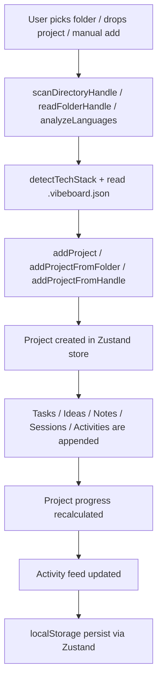
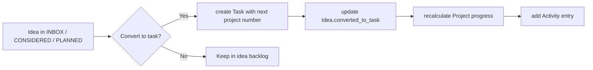
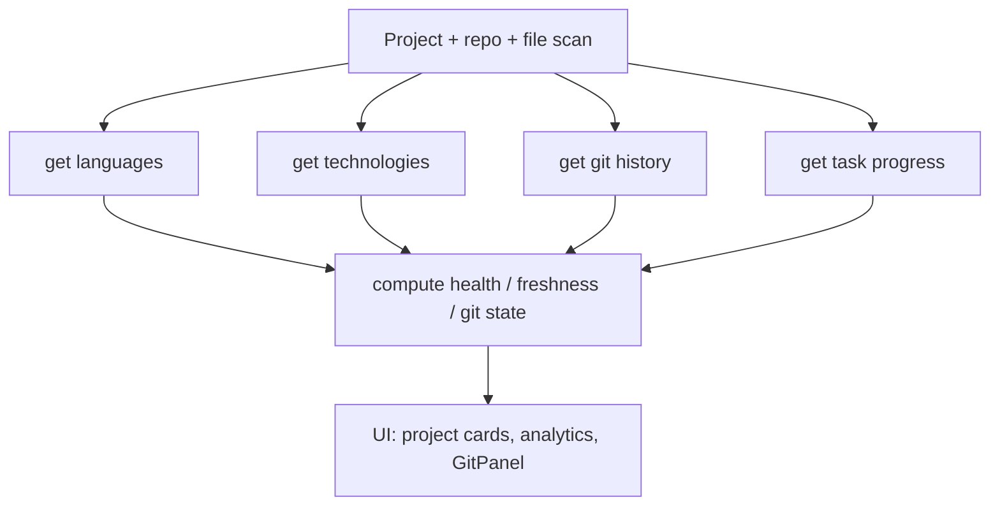
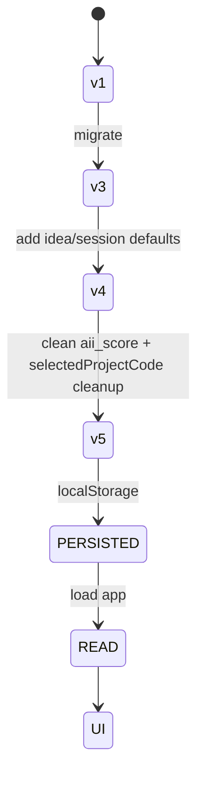

# VibeBoard data and state diagrams

This document summarizes the real data model used by the app based on `src/lib/types.ts`, `src/store/useStore.ts`, and the persistence layer.

## 1) Core data model (ER diagram)



### Notes on the model

- `Project` is the primary entity and owns most of the domain content.
- `Task` is project-scoped and numbered within a project (`number` starts at 1, computed in `useStore.addTask`).
- `Idea` can be converted into a `Task` via `convertIdeaToTask` or `bulkConvertIdeas`.
- `Session` tracks working time, notes, and tasks completed during a run.
- `Activity` is an append-only event log for UI history and project timeline.
- `ProjectLanguage` is a derived result of file-byte analysis; this is not a separate table in the DB, but a nested array in `Project.languages`.

## 2) Actual app state in Zustand

The app stores the main domain as one persisted root state object, not as separate database tables.

```mermaid
flowchart LR
  A[Zustand store] --> B[projects: Project[]]
  A --> C[tasks: Task[]]
  A --> D[ideas: Idea[]]
  A --> E[notes: Note[]]
  A --> F[sessions: Session[]]
  A --> G[activities: Activity[]]
  A --> H[folder, locale, filters]

  I[persist middleware] --> J[localStorage: vibeboard-store]
  A --> I
```

### Persisted fields

`src/store/useStore.ts` persists:

- `projects`
- `tasks`
- `ideas`
- `notes`
- `sessions`
- `activities`
- `folder`
- `hasOnboarded`
- `locale`
- filter state

The store uses versioning (`version: 5`) and `migrate` to clean legacy fields and keep compatibility.

## 3) State machine for tasks

This reflects the real transitions implemented in `updateTask`, `addTask`, and conversions from ideas.



### Task business rules from code

- `Task.number` is per-project and auto-generated via `maxNum(...) + 1`.
- `Task.progress` is recalculated from task status distribution for the project.
- If a task is marked `DONE`, the active session auto-links it via `active.tasks_completed`.
- Ideas can be converted to tasks with the same title and project linkage.

## 4) State machine for sessions

This reflects the session lifecycle in `addSession`, `togglePauseSession`, `endSession`, and `appendSessionNote`.



### Session semantics in the app

- A session is created with `project_id`, `goal`, `started_at`, and an empty `notes` log.
- `is_paused` and `paused_ms` are tracked while running.
- `tasks_completed` is updated as tasks with status `DONE` are linked to the active session.
- An ended session stores a final `summary` and can be used for manual or agent-driven follow-up.

## 5) Project lifecycle / data flow



### Important project-flow behaviors

- Real file analysis is preferred: languages are derived from byte-level scan, not guessed by filename alone.
- If a project has a `.vibeboard.json`, it can override `type`, `status`, and `code`.
- Git metadata (`last_commit`, `branch`, `commits_this_week`) is derived from history scanning when available.
- The app deliberately avoids fake `languages`/`tech stack` entries when the scan is unavailable.

## 6) Idea → task conversion flow



This is implemented in `convertIdeaToTask` and `bulkConvertIdeas`.

## 7) Project health / analysis data flow



This aligns with the README and `src/lib/health.ts` description: project health is derived from multiple signals rather than a single metric.

## 8) Persistence and migration model



Notes:

- The real app uses `persist` from Zustand, with `name: 'vibeboard-store'`.
- Version migrations exist to keep old data stable after schema changes.
- The state is intentionally kept in app memory + localStorage for a lightweight local-first architecture.

## 9) Summary

The app’s true data structure is a set of related arrays under one Zustand root store, rather than a relational database. This makes the domain simple and fast for a local-first tool, while still preserving clear relationships:

- one `Project` owns many `Task`, `Idea`, `Note`, `Session`, and `Activity`
- `Task` is the execution unit
- `Idea` is the backlog unit
- `Session` is the time-tracking unit
- `Activity` is the event log
- `Project` includes derived analysis (`languages`, `techs`, `git metadata`, `progress`)

This keeps the architecture understandable while allowing a future migration to IndexedDB/Dexie/SQLite without changing the product model completely.
